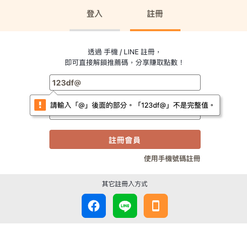
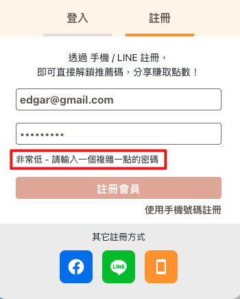
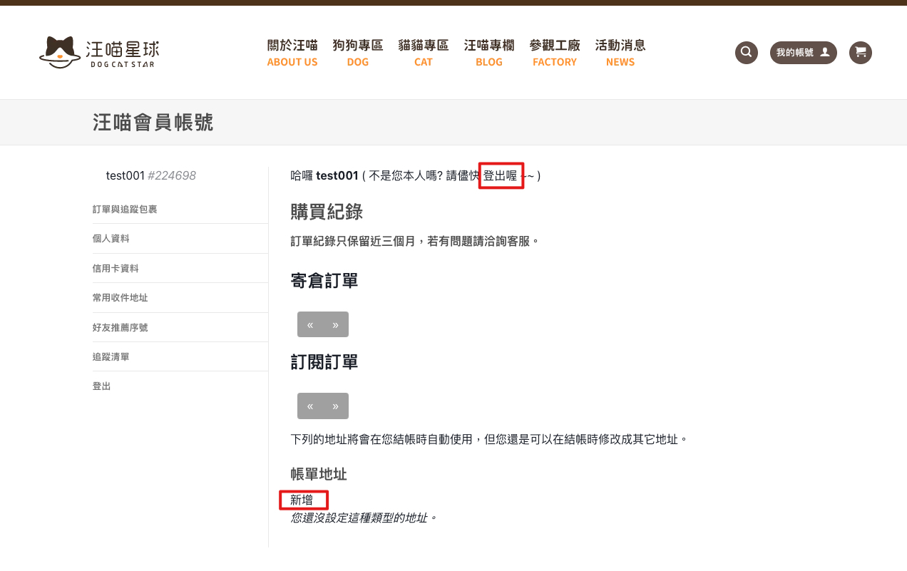

# 汪喵星球DogCatStar_觀察

註冊問題：email註冊不用驗證碼，這導致我們可以註冊一個不存在的email帳號


如果沒有驗證碼會引起安全性跟可信度的問題，比如自動化註冊攻擊增加伺服器負載、用戶資訊安全風險，同時這種情況的出現意味著系統可能對於用戶的身份驗證不夠嚴謹，這會有資安風險

解決方案：增加驗證碼的按鈕

＿＿＿＿＿＿＿＿＿＿＿＿＿＿＿＿＿＿＿＿＿＿＿＿＿＿＿＿＿＿＿＿＿＿＿＿＿＿＿＿＿＿＿＿＿＿＿＿＿＿＿＿＿＿＿＿＿＿＿  
  
  
註冊問題：email正則加強跟提示的做法有點耗時

 
當我使用非email格式輸入email時，它會先跳一個提示，輸入的值

```

123df@

```



後續輸入

```

123df@1

```

提示就會消失了，這時候點擊註冊時，會跳轉到註冊分頁-手機分頁，並回傳一個提示

  

這會有幾個問題：

1.email的正則表示要更精確一點

2.提示的呈現是用一頁式的，這會導致提示的彈出需要刷新畫面，除了會增加系統負載以外，也會增加使用者等待的時間

3.我用email註冊，但註冊失敗也應該要回到email分頁才對

解決方案：

1.正則需要精確一點，像是 abc@a.b 的模式

2.提示的呈現改用toast或是input底下出現紅色字眼的提示，這個由前端判斷，不符合情況就擋下來，不用打到API

3.如果要用由前端判斷的話，這個可以不用改，因為畫面不會切換，但如果維持原有的跳轉方式，需要跳轉到email分頁

＿＿＿＿＿＿＿＿＿＿＿＿＿＿＿＿＿＿＿＿＿＿＿＿＿＿＿＿＿＿＿＿＿＿＿＿＿＿＿＿＿＿＿＿＿＿＿＿＿＿＿＿＿＿＿＿＿＿＿  


樣式問題：提示說明、可點擊的按鈕應該要有比較明顯的顏色


  

比如此頁面，註冊時格式不符合、密碼強度不夠等情況而出現的提示，應該要有比較顯眼的區別


  

兩個紅框的位置是可點擊的按鈕，但樣式很像是文字，可點擊的按鈕要跟文字樣式需要有區別，這樣使用者才可區別

＿＿＿＿＿＿＿＿＿＿＿＿＿＿＿＿＿＿＿＿＿＿＿＿＿＿＿＿＿＿＿＿＿＿＿＿＿＿＿＿＿＿＿＿＿＿＿＿＿＿＿＿＿＿＿＿＿＿＿  

自動化範例呈現：  
https://github.com/EdgarChen11/Edgar/assets/110076175/66d0c8ff-5c4c-4e03-9afe-0d5b6644ee96